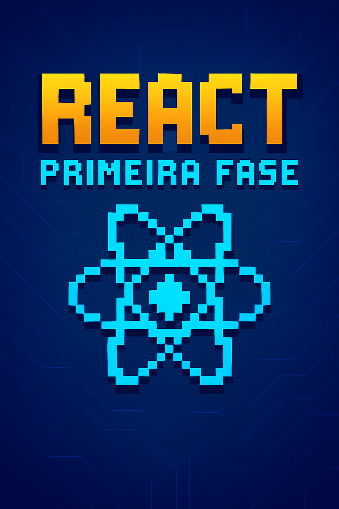

-------

# Projeto EBOOK Gerado por IAs

Projeto com o objetivo de gerar um ebook digital com as facilidades das ferramentas de IA. todos os prompts
seguem abaixo.

<a href="https://github.com/felipeAguiarCode/prompts-recipe-to-create-a-ebook/blob/main/output/ebook%20-%20css%20jedi%20output.pdf" title="View PDF now"> 📕Clique aqui para ler</a>

## 💻 Tecnologias utilizadas no projeto

- [ChatGPT](https://chat.openai.com/) 
- [Canva](https://www.canva.com/)

## 🧠 Prompts

ChatGPT：

|   Ação   | Prompt                                                                                                                                                                                                                                                                         |
| :------: | ------------------------------------------------------------------------------------------------------------------------------------------------------------------------------------------------------------------------------------------------------------------------------ |
|  Título  | Faça o título para um ebook sobre o tema React (a biblioteca front-end), o ebook é do nicho de programação, e eu penso em fazer algo para iniciantes, além de abordar a nova versão, 19.2. o título deve ser épico e curto, e tenha uma temática de jogos no título, me diga 10 variações de títulos                                                        |
| Conteúdo | Em relação ao react 19.2, quero falar sobre o novo componente, que é o Activity. Quero que você gere o conteúdo: - Página de apresentação; - Sumário; - Introdução ao React; - Conceitos fundamentais; - O que há de novo no React 19.2; - Conclusão |
| Capa | Gere uma imagem com as seguintes instruções: A capa apresenta um design digital minimalista com estética retrô inspirada em jogos 8/16 bits. Na parte superior, o título “REACT” aparece em letras grandes e quadradas, com gradiente amarelo-alaranjado e sombras que lembram os logotipos pixelados de games antigos. Logo abaixo, o subtítulo “PRIMEIRA FASE” está escrito em azul-ciano, também em estilo pixel art, mantendo o ar gamer. Ao centro, há um ícone do React reinterpretado como símbolo pixelado, composto por linhas azul-ciano que formam a estrutura atômica característica da biblioteca. O fundo é azul-escuro, com linhas sutis que lembram circuitos eletrônicos ou trilhas de placa-mãe, dando uma sensação tecnológica e de profundidade. O conjunto transmite a ideia de primeiro nível de um jogo de programação, equilibrando nostalgia e modernidade, ideal para um eBook de introdução ao React. |

## ✨ Features

- Conteúdo gerado via ChatGPT

## 📚 Materiais

- Imagens utilizadas em `assets`
- Ebook gerado durante as aulas em `output`

